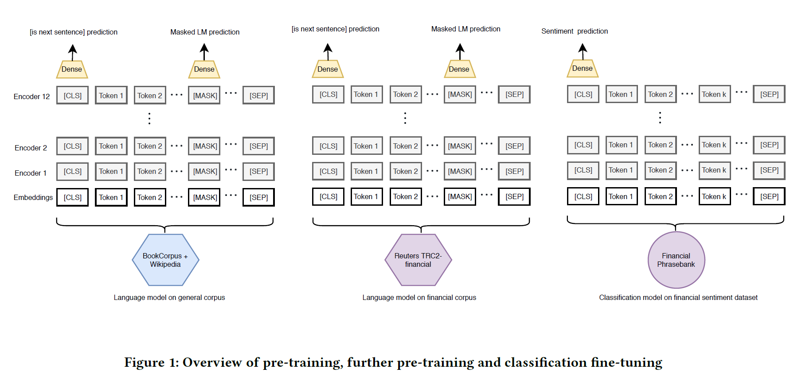

```{r setup, include=FALSE}
knitr::opts_chunk$set(echo = TRUE)
```
### Tech Review by Praveen Purohit. purohit4@illinois.edu

## Introduction

FinBert is an opensource pre trained NLP model, that has been specifically trained on Financial data, and outperforms almost all other NLP techniques for sentiment financial analysis.

Doing sentiment analysis on financial data is more complicated than normal use cases. Lets take an example

```{md}
Food companies doing well despite the global markets downturn due to covid
```

Normal NLP techniques will not be able to determine that the above sentence is actually good news and has positive sentiment for food companies. This is due to the fact that normal NLP techniques, like word2vec, look at each word separately and dont have context for the words. To understand the sentiment of the above sentence we would need to be context aware.

## BERT

This is where BERT comes in. BERT stands for Bidirectional Encoder Representation from Transformer. It is one of the most popular state of the art text embedding model published by Google. BERT has caused a revolution in the world of NLP by providing superior results on many NLP tasks, such as question answering, text generation, sentence classification, and many more compared to other methods.

One of the reasons BERT is more successful is that it uses a context based embedding model. Consider the example below

```{md}
Sentence 1: The python ate the rabbit

Sentence 2: Python is one of the most popular programming languages
```

Without context, the word python would have the same meaning in both sentences. BERT looks at the sentence and figures out what words python is related to in the sentence, and will create embedding of the word python based on the context. BERT does this by using transformers, which is a state of the art deep learning architecture, that is mostly used for Natural language processing. The architecture uses encoder-decoder paradigm. The encoder takes the input sentence and learns its representation and then sends the representation to the decoder. The decoder generates the output sentence. The transformer architecture uses many layers of encoders to generate the representation. BERT can be thought of as a transformer, but only with encoders. BERT has different configurations based on how many encoder layers it uses. 

BERT model is pretrained on a large corpus of words. What is pretraining? Pretraining is when we train a model with a huge dataset for a particular task and save the trained model. For any new task, instead of initializing a new model with random weights, we will initialize it with the weights of the trained model, and adjust the weights for the new task. The BERT model is pre-trained on a huge corpus using two tasks, masked language modeling and next sentence prediction. BERT models have been trained on BookCorpus and English Wikipedia, which have in total more than 3.5 Billion words.

## FinBERT

Now to tie things back to FinBERT. FinBERT is a language model based on BERT. It further trains the BERT model for financial data. The additional training corpus is a set of 1.8M Reuters’ news articles and Financial PhraseBank. The main sentiment analysis dataset used in this paper is Financial PhraseBank which consists of 4845 english sentences selected randomly from financial news found on LexisNexis database. These sentences then were annotated by 16 people with background in finance and business. 


```{r pressure, echo=FALSE, fig.cap="Overview of Pre training (ref: FinBERT: Financial Sentiment Analysis with Pre-trained Language Models by Dogu Tan Araci)", out.width = '100%'}

```

## Implementation

FinBERT sentiment analysis model is available on Hugging Face model hub. You can get the model at https://huggingface.co/ProsusAI/finbert. FinBERT implementation relies on Hugging Face's pytorch_pretrained_bert library and their implementation of BERT for sequence classification tasks. There are two reference implementations you can look at

1) https://github.com/ProsusAI/finBERT/blob/master/scripts/predict.py
2) https://colab.research.google.com/drive/1C6_ahu0Eps_wLKcsfspEO0HIEouND-oI?usp=sharing


## Conclusion

FinBeERT makes the job a on sentiment analysis for financial feeds very easy, and a lot more accurate. The heavy lifting for training and testing a model on a very large financial corpus has already been done by the researchers, and the model has been democratized by Hugging Face. The rest of us can simply use it with very few lines of code to get fairly accurate results for financial sentiment analysis.

## References

- Book "Getting Started with Google BERT. Author: Sudharsan Ravichandiran, Packt publishing"
- Source implementation: https://github.com/ProsusAI/finBERT
- Thesis: FinBERT: Financial Sentiment Analysis with Pre-trained Language Models Dogu Tan Araci (https://arxiv.org/pdf/1908.10063.pdf)
- Blog: https://medium.com/prosus-ai-tech-blog/finbert-financial-sentiment-analysis-with-bert-b277a3607101
- Blog: Financial Sentiment Analysis on Stock Market Headlines With FinBERT & Hugging Face (https://wandb.ai/ivangoncharov/FinBERT_Sentiment_Analysis_Project/reports/Financial-Sentiment-Analysis-on-Stock-Market-Headlines-With-FinBERT-Hugging-Face--VmlldzoxMDQ4NjM0)

